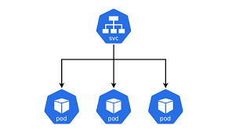

### Deploy on K8s

`kubectl apply -f deployment/deployment.yaml`

### View all
`kubeclt get all -o wide`

### View deployment
`kubectl get deployment`

### To show history of deployment
`kubectl rollout history deploy/application`

### To see the update progress of deployment
`kubectl rollout status deploy/application`

### To view update 1 information, type the command
`kubectl rollout history deploy/application --revision=1`

### When you need to roll back to an old version
`kubectl rollout undo deploy/application --to-revision=1`

### Undo rollout
`kubectl rollout undo deploy/application`

### Scale pod
`kubectl scale deploy/application --replicas=10`

### Auto scale depend on vCPU
`kubectl autoscale deploy/application --min=2 --max=5 --cpu-percent=50`

### Get service
`kubectl get service`

### Show service info
`kubectl describe service/application`